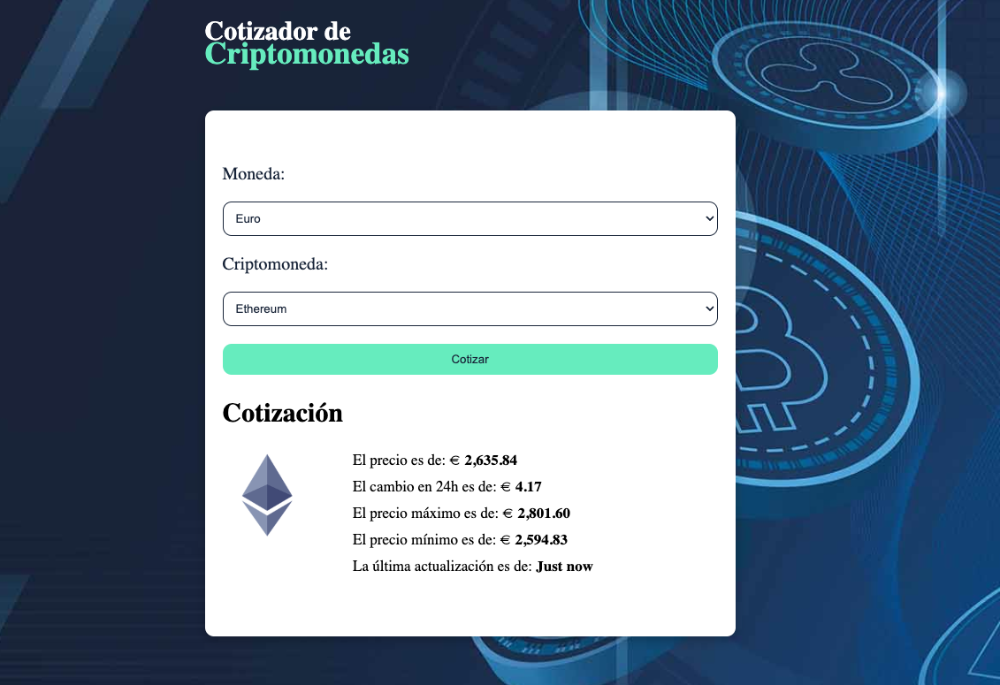

# CryptoApp - React, Zustand & Zod

## Descripción
Este proyecto es una aplicación de seguimiento de criptomonedas desarrollada con **React**, en la cual he aprendido a gestionar el estado global con **Zustand** y a realizar llamadas a APIs de manera eficiente. Además, he utilizado **Zod** para validar y estructurar correctamente los datos obtenidos de la API.

## Tecnologías utilizadas
- **React**: Biblioteca principal para la construcción de la interfaz.
- **Zustand**: Para el manejo del estado global de la aplicación, proporcionando una solución ligera y sencilla.
- **Zod**: Para asegurar que los datos recibidos de la API tengan la estructura esperada.
- **Axios**: Para realizar las llamadas a la API de criptomonedas.
- **Vite**: Para la configuración y optimización del entorno de desarrollo.

## Lecciones aprendidas
1. **Gestión de estado con Zustand**:
   - Simplifica la administración del estado global sin necesidad de Redux.
   - Facilita el acceso y modificación del estado desde cualquier parte de la aplicación.
   
2. **Validación de datos con Zod**:
   - Ayuda a evitar errores al definir esquemas de datos precisos.
   - Permite transformar y validar datos de forma sencilla.
   
3. **Manejo de APIs**:
   - Uso de Axios para realizar llamadas asíncronas de manera eficiente.
   - Implementación de control de errores para manejar respuestas inesperadas.

## Deploy
Puedes ver la aplicación funcionando en el siguiente enlace:  
🔗 [CryptoApp Deploy](https://juli-crypto-api.netlify.app)

